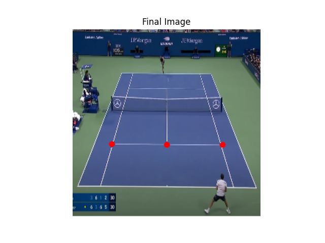
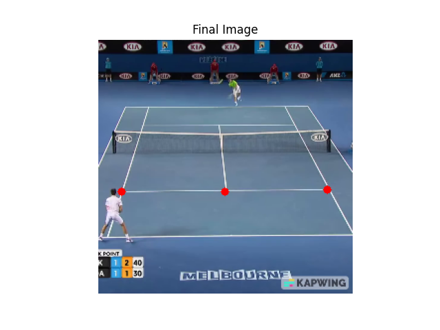

# tennis-court-detection
 CV project for auto detecting courts and players

# Requirements
Packages found in requirements.txt, recommend creating a virtual environment first

With Conda:
`conda create -n "NAME_OF_ENVIRONMENT" python=3.9.0`
Activate Environment
`conda activate "NAME_OF_ENVIRONMENT"`

Then install packages
`pip install -r requirements.txt`

###Examples:

